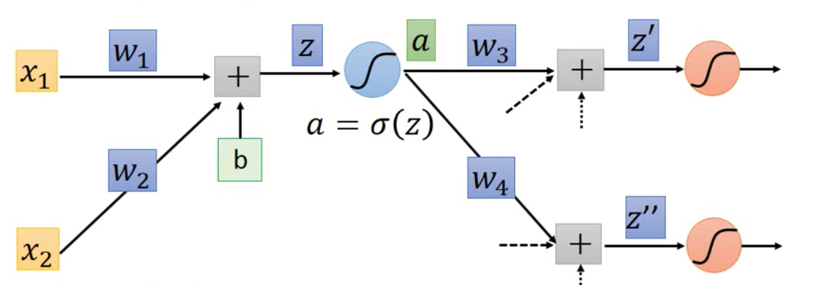

This is extended work from [iamtrask's blog](https://iamtrask.github.io/2015/07/12/basic-python-network/), I add some mathematical derivation for cost function to help people understand why this model can learn.

Concept of backpropagation, see this image:

In this 2 layer example, we don't have w3, w4, z' and z''. a is our final output.